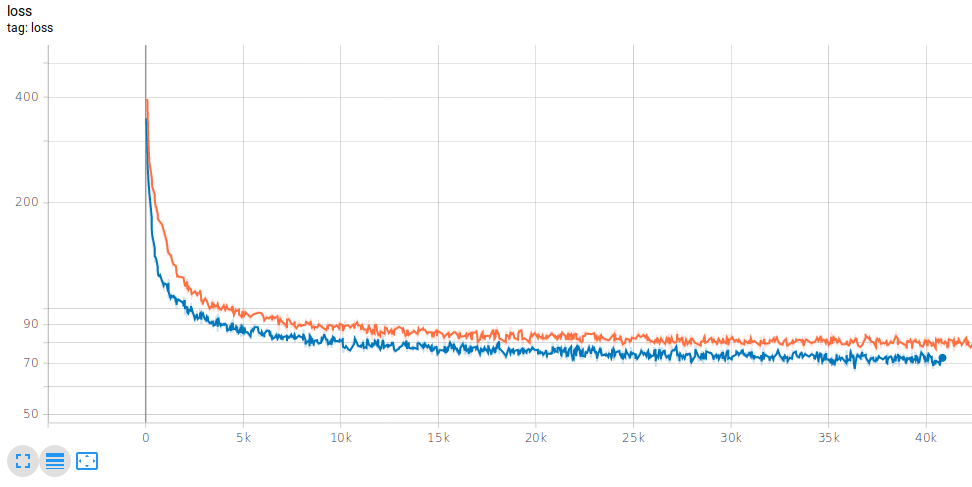

## Overview
This repository holds a slightly modified version of the CVAE tutorial (https://www.tensorflow.org/alpha/tutorials/generative/cvae) using TensorFlow 2.0 - Alpha.

## Get Started

The following information is needed in order to get this project up and running on your system.

#### Environment

1. Create a `virtualenv` using `virtualenv python=python3 .venv`.
2. Run using `source .venv/bin/activate` to start the environment, and `deactivate` to close it.
3. Install dependencies using `pip install -r requirements.txt`

#### Command Line Arguments

command line arguments used in the project:
```
parser.add_argument('--latent_dim', type=int, default='50')
parser.add_argument('--learning_rate', type=float, default='1e-4')
parser.add_argument('--num_examples_to_generate', type=int, default='16')
parser.add_argument('--train_buf', type=int, default='60000')
parser.add_argument('--batch_size', type=int, default='100')
parser.add_argument('--epochs', type=int, default='100')
parser.add_argument('--save_dir', type=str, default='./saves/')
parser.add_argument('--log_dir', type=str, default='./logs/')
parser.add_argument("--log_freq", type=int, default=2)
parser.add_argument('--extension', type=str, default=None)
parser.add_argument('--test_buf', type=int, default='10000')
```

#### Train

Running `python3 main.py` to begin training the model.

#### Tensorboard

This project uses tensorboard for viewing the training loss and images. In a separate terminal window, run `tensorboard --logdir logs` to run tensorboard locally. With this, you can view the loss in the *SCALARS* tab, and images in the *IMAGES* tab.

#### Evaluation

I added a few ResNet blocks to see if there was an improvement, but unfortunatly it only added a 4x training time for marginally improved results. Screenshot shown below. **Note**: This is using a log scale for the y-axis, so the difference is very small.



I halved the number of resnet blocks after this test. It seems to just make the model converge in less steps, but longer training time.

### Notes/TODO

- Add model saving and loading
- Validate with training (uncomment and make function)
- 